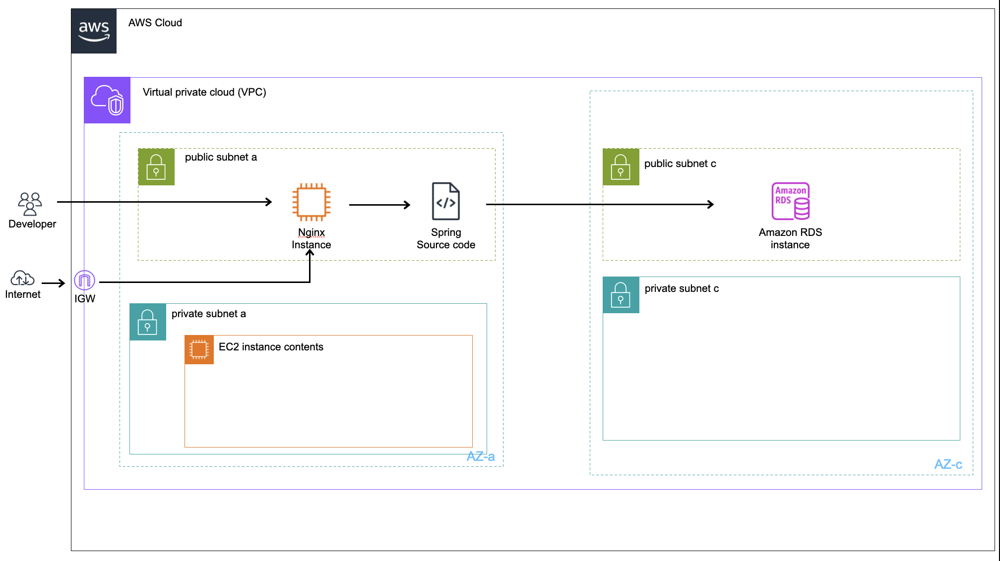
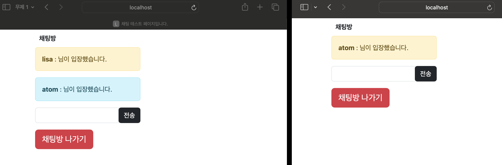
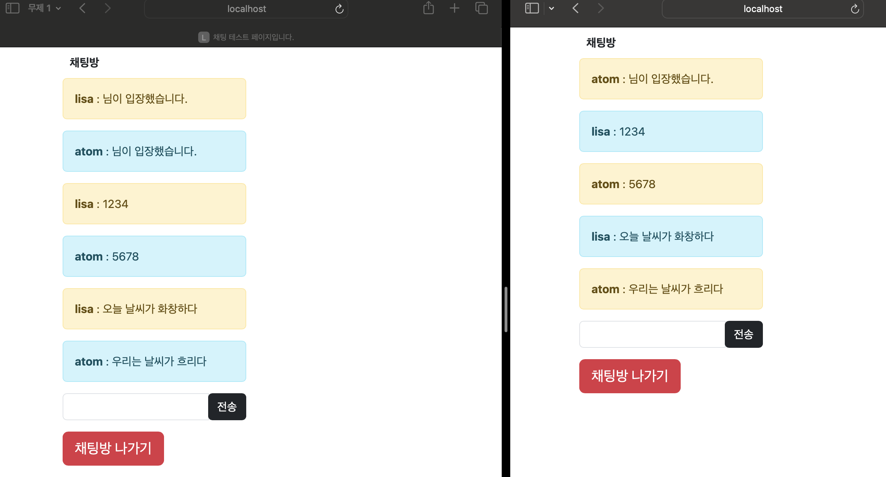
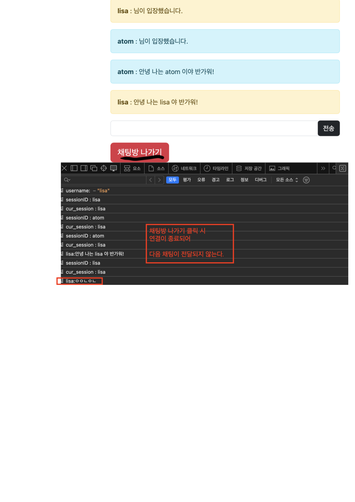
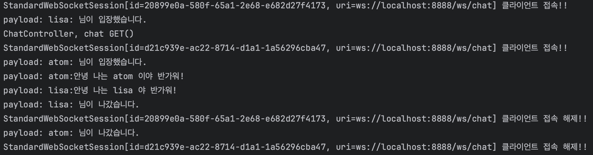

> 채팅 프로그램 핵심: 채팅방에서 텍스트 메시지를 다른 클라이언트와 주고 받을 수 있다.

---

## 이 프로그램에서 사용되는 AWS 인프라 구조

---

## WekSocket 브라우저 통신 (Safari, Chrome 확인)

---

---

---

> Spring WebSocket을 이용해 텍스트 메시지를 실시간으로 주고 받을 수 있습니다.

---

## 기능 목록 작성

- [] 사용자의 요청을 처리하는 컨트롤러
    - [x] sns 사용자 로그인 요청 - MemberController#snsSignUp()
    - [x] 사용자 친구 목록 요청 - MemberController#searchByFriends()
    - [x] 사용자 친구 추가 요청 - MemberController#addMemberOfFriends()
- [] 서버 환경 설정
    - [x] Web API 문서 Server, Contact, Info, License 정의 - SwaggerConfig#chatOpenApi()
    - [x] 웹 소켓 경로 및 허용 오리진 설정 - WebSocketConfig#registerWebSocketHandlers()
    - [x] 사용자 정의 소켓 핸들러 Spring 제공 웹 소켓 연결 설정 - WebSocketConfig#webSocketHandler()
- [] 공통 상수
    - [x] HTTP 상태코드 래핑 상수 - ResponseType
- [] 데이터 처리를 위한 서비스 로직
    - [x] 사용자 고유 키 값을 통해 친구 테이블 데이터 저장 - FriendService#saveFromMemberId()
    - [x] 사용자와 연결된 친구 목록을 조회 - MemberService#getMemberFriends()
    - [x] 사용자 정보를 저장 - MemberService#saveEntity()
    - [x] sns 토큰 정보 저장 - SnsInfoService#saveEntity()
- [] 소켓 통신을 위한 핸들러
    - [x] 웹 소켓 세션을 통해 들어오는 메시지 내용 처리 - CustomSocketHandler#handleTextMessage()
    - [x] 클라이언트가 접속 시 호출되어 웹 소켓 세션 추가 - CustomSocketHandler#afterConnectionEstablished()
    - [x] 클라이언트가 접속 해제 시 호출되어 웹 소켓 세션 제거 - CustomSocketHandler#afterConnectionClosed()
